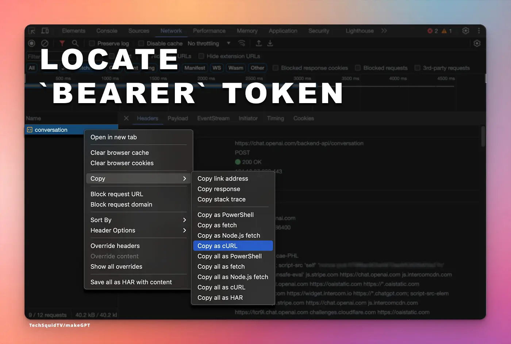

# makeGPT

> ⚠️ **pre-alpha**: This code is in active development and **_not_** ready for use. Watch for our first release.

<div style="text-align: center;">
  
</div>

`makeGPT` is a command-line tool for creating, managing, and publishing [custom GPTs from OpenAI](https://openai.com/blog/introducing-gpts).

## Key Features

* **Manage Custom GPTs as Git Repositories:** Version control and manage your GPTs like a developer.
* **CI/CD Integration:** Deploy from automated pipelines: Use the publish command in CI to deploy new versions.
* **No Web Interface Dependency:** Say goodbye to manually copy-and-pasting updates from your text editor.

## Getting Started

### Prerequisites
* An active OpenAI account with access to the _premium_ version of ChatGPT.
  * Custom GPTs are currently a premium feature

#### Obtain a Bearer Token

**Step 1:** Obtain Bearer Token

You'll need a Bearer token from OpenAI for authentication.

To get the Bearer token:

1. Use Chrome's DevTools and navigate to the Network tab.
1. Ensure the Network tab is recording.
1. Enter some message into ChatGPT to record the post.
1. Locate the `POST` request to `conversation`.
1. Right-click on `conversation` > Copy as cURL.
1. Extract the Authorization: Bearer {token} header value.

Place `{token}` in a `.env` file or set an environment variable as `OPENAI_BEARER_TOKEN`



#### Initialize New GPT Project

**Step 2:** Initialize New GPT Project

Use `makegpt init [path]` to create a new GPT project either in the current directory or at a specified path.

Example output:

```
my-gpt
├── actions
│   └── weather.json
├── avatar.png
├── gpt.yaml
└── knowledge
    └── makeGPT.md

2 directories, 4 files

```
#### Publish GPT

**Step 3:** Publish GPT

Deploy your GPT to OpenAI using `makegpt publish [type]`, where `[type]` can be `public` or `private`.

## Contributing

We welcome contributions! Please read our Contributing Guide (coming soon) for details on our code of conduct and the process for submitting pull requests.

## License
This project is licensed under the [MIT License](./LICENSE).

We are in no way affiliated with [OpenAI](https://openai.com). 